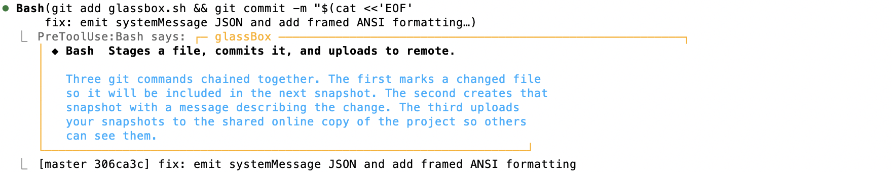

# glassBox

A [Claude Code hook](https://docs.anthropic.com/en/docs/claude-code/hooks) that explains what every tool does while Claude works — in plain English.

When Claude calls a tool (Bash, Read, Edit, Grep, etc.), glassBox prints a short explanation of what the tool does and what its arguments mean. Explanations are generated by Claude and cached locally.



```
  ◆ Grep  Searching file contents
    Grep scans files using a regular expression. The type flag
    limits the search to a specific file extension, so only
    relevant files are checked.

  ◆ Read  Reading a file from disk
    Read loads a file's contents so Claude can examine it. The
    offset and limit parameters select a range of lines instead
    of loading the whole file.

  ◆ Bash  Running TypeScript type checker
    npx runs a locally installed package without global install.
    tsc is the TypeScript compiler. The --noEmit flag checks types
    without producing output files.
```

Once you understand a tool, mark it as "learned" — it still shows a one-liner but skips the extended explanation.

## Prerequisites

- [Claude Code](https://docs.anthropic.com/en/docs/claude-code) CLI installed
- `jq` (JSON processor)
- `shasum` (ships with macOS; install `coreutils` on Linux)

## Install

```bash
git clone https://github.com/yoelf22/claude-hooks-glassbox.git ~/.claude/hooks/glassbox
cd ~/.claude/hooks/glassbox
./install.sh
```

This registers a `PreToolUse` hook in `~/.claude/settings.json` and creates a cache directory at `~/.glassbox/cache/`.

Restart Claude Code to activate.

### Add the CLI to your PATH

The `glassbox` CLI lets you manage learned tools and the cache. Add it to your shell profile:

```bash
export PATH="$HOME/.claude/hooks/glassbox:$PATH"
```

## How it works

glassBox runs as a `PreToolUse` hook — it fires before every tool call. On each invocation it:

1. Reads the tool name and input from stdin (JSON)
2. Normalizes the input — strips file paths, URLs, branch names, and secrets so only the command structure remains
3. Hashes the normalized input and checks a local cache (`~/.glassbox/cache/`)
4. On a cache miss, calls Claude to generate an explanation
5. Prints the explanation to stderr

**Privacy**: no file paths, URLs, branch names, or secrets are sent to the LLM. Only the tool name and structural pattern (e.g., `git checkout -b` rather than `git checkout -b my-secret-branch`) reach the model.

## Learn / dismiss tools

Once you understand what a tool does, dismiss the extended explanation:

```bash
glassbox learn Read           # dismiss the Read tool
glassbox learn Bash:git       # dismiss all Bash git commands
glassbox learned              # list dismissed tools
glassbox unlearn Read         # re-enable full explanations
```

Learned tools still show the brief one-liner, just not the paragraph below it.

## Cache

Explanations are cached in `~/.glassbox/cache/` and auto-expire after 30 days. To clear manually:

```bash
glassbox clear-cache
```

## Demo

Run the demo to see what glassBox output looks like without starting a Claude session:

```bash
./demo.sh
```

## Uninstall

```bash
cd ~/.claude/hooks/glassbox
./uninstall.sh
```

This removes the hook from `~/.claude/settings.json` and optionally deletes the cache.

## License

MIT
